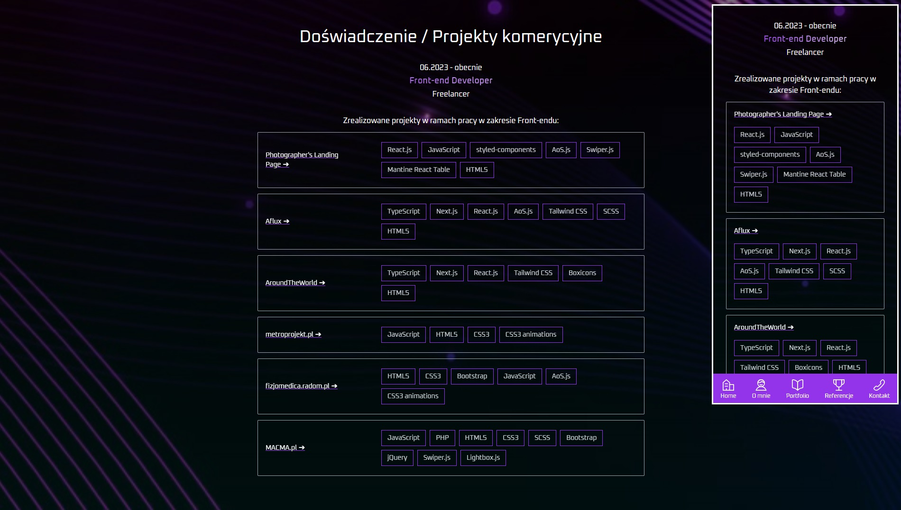

<p align="center">
    
</p>

<h1 align="center">Vue.js Tailwind CSS - brand new portfolio</h1>

<p align="center">My brand new portfolio written using modern front-end technologies like Vue.js, TypeScript, Tailwind CSS.</p>
<p align="center">On this site you can find information about my skills, experience and completed projects.</p>
<p align="center">There are sections containing detailed information about my technologies and tools that I use during my work, information about my experience and education.</p>
<p align="center">In addition, you will find a tab with my references from satisfied clients.</p>

## Technologies

Used technologies:

- TypeScript
- Vue.js
- Tailwind CSS
- AoS.js

Project created with:

- Vite

## Project structure

```
.
└── vuejs-tailwindcss-portfolio/
    ├── .vscode/
    ├── dist/
    ├── public/
    │   └── favicon.ico
    ├── src/
    │   ├── assets/
    │   │   ├── img/
    │   │   ├── base.css
    │   │   └── main.css
    │   ├── components/
    │   │   ├── __tests__/
    │   │   ├── about_me/
    │   │   ├── buttons/
    │   │   ├── common/
    │   │   ├── contact/
    │   │   ├── home/
    │   │   ├── portfolio/
    │   │   └── references/
    │   ├── router/
    │   │   └── index.ts
    │   ├── views/
    │   │   ├── AboutView.vue
    │   │   ├── ContactView.vue
    │   │   ├── HomeView.vue
    │   │   ├── PortfolioView.vue
    │   │   └── ReferencesView.vue
    │   ├── App.vue
    │   ├── index.css
    │   └── main.ts
    ├── .eslintrc.cjs
    ├── .gitignore
    ├── README.md
    ├── env.d.ts
    ├── index.html
    ├── package-lock.json
    ├── package.json.gitignore
    ├── postcss.config.js
    ├── tailwind.config.js
    ├── tsconfig.app.json
    ├── tsconfig.json
    ├── tsconfig.node.json
    ├── tsconfig.vitest.json
    ├── vite.config.ts
    └── vitest.config.ts
```

## Live link

- https://goldipl.github.io/vuejs-tailwindcss-portfolio/

## How to open project locally? Info below.

### Project Setup

```sh
npm install
```

### Compile and Hot-Reload for Development

```sh
npm run dev
```

### Type-Check, Compile and Minify for Production

```sh
npm run build
```

### Run Unit Tests with [Vitest](https://vitest.dev/)

```sh
npm run test:unit
```

### Lint with [ESLint](https://eslint.org/)

```sh
npm run lint
```

## Screenshots





## Additional info

### Recommended IDE Setup

[VSCode](https://code.visualstudio.com/) + [Volar](https://marketplace.visualstudio.com/items?itemName=Vue.volar) (and disable Vetur).

### Type Support for `.vue` Imports in TS

TypeScript cannot handle type information for `.vue` imports by default, so we replace the `tsc` CLI with `vue-tsc` for type checking. In editors, we need [Volar](https://marketplace.visualstudio.com/items?itemName=Vue.volar) to make the TypeScript language service aware of `.vue` types.

### Customize configuration

See [Vite Configuration Reference](https://vitejs.dev/config/).
